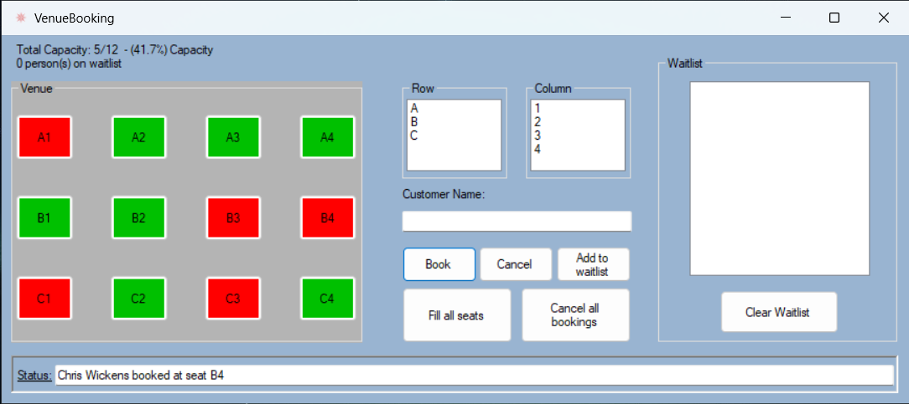

# VenueBooking

This program is an example of using C# and WinForms to create a venue booking program.

I plan on re-writing this using WPF, to follow better MVVM principles, and give it a more robust interface.

I would also like to add support for tracking the venue seating if the program is closed (writing seating information to a file, and reading from said file when the program starts).
## Authors

- [Chris Wickens](https://www.github.com/chriswickens)

## Screenshots

